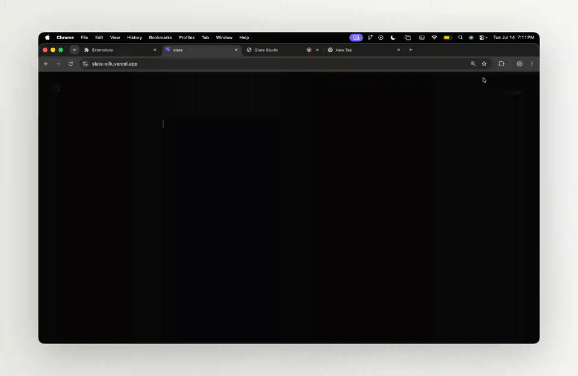
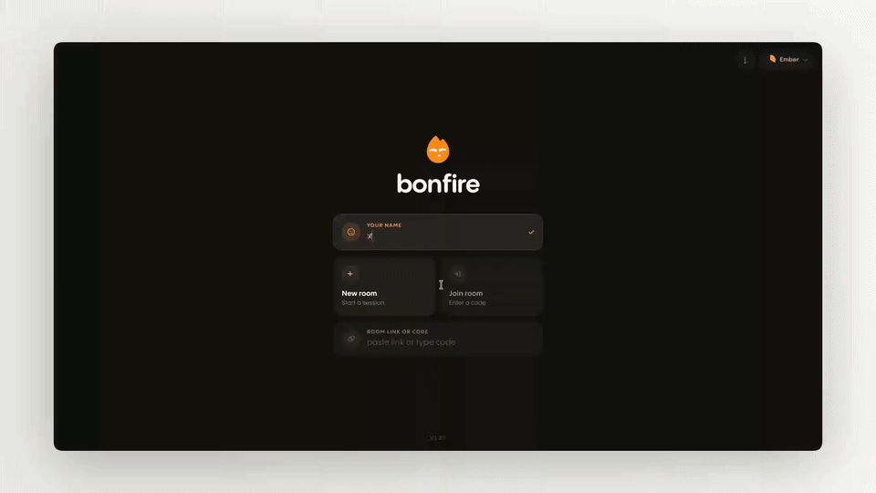
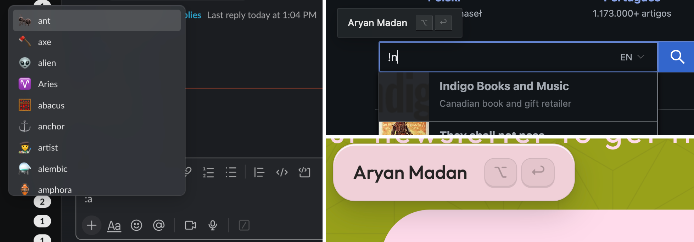

**Quipped** is a lightweight text expansion extension for Chrome that blends seamlessly into every website you use. Instead of memorizing long snippets, create **Quips**, which are short triggers that instantly expand into longer text.

## Quips
Create your own text shortcuts or Quips using a `!` prefix.

Whether it's emails, addresses, signatures, common responses, or email templates, Quips help you type less and say more.

---

## Global Emoji Bar

Quickly search and insert emojis from anywhere on the web without leaving your keyboard.

---

## Adaptive Styling

Unlike most extensions that look the same everywhere, and look quite different than the website you're on, Quipped matches its border radius, font, spacing, and even colors to the site you're on, so the UI feels native instead of intrusive.

---

## Installation (Chrome)
1. Download the latest `dist.crx` from the Releases page.
2. Open `chrome://extensions`.
3. Enable **Developer mode**.
4. Drag and drop `dist.crx` onto the Extensions page.
5. Click **Add extension** if prompted.

---

### AI Usage
- css & styling
- debugging
- emoji fuzzy search

Made with ❤️ by Ary
